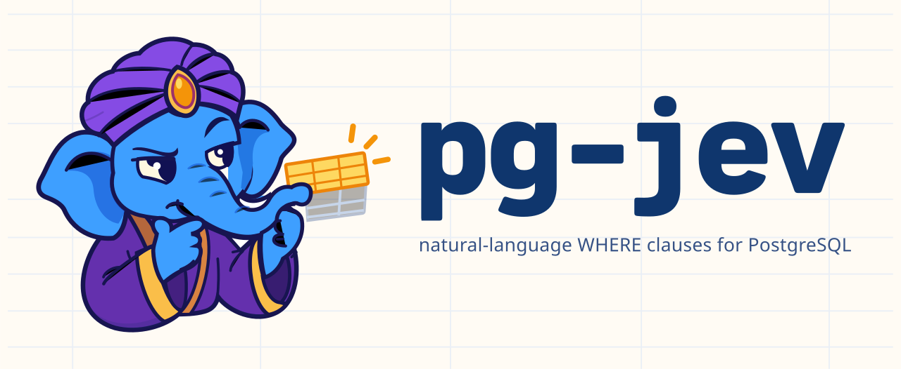

<p align="center">
  
</p>

# jev — ask your Postgres tables questions in plain language

[](https://github.com/realZachi/pg-jev/actions/workflows/ci.yml)
[](LICENSE)
[](https://pgjev.com)

Write the condition the way you would say it. Postgres does the rest.

`jev` lets you filter, rank and classify rows with plain-language conditions. Every row is judged by
[TypeSafe's Jev](https://docs.typesafe.ai), a System One model that returns calibrated probabilities
instead of generated text. No index, no embeddings, no vector column.

Website: [pgjev.com](https://pgjev.com)

```sql
CREATE EXTENSION jev CASCADE;

SELECT * FROM people WHERE jev(people, 'the name is European');

SELECT subject, jev_prob(tickets, 'the customer is angry') AS p
FROM tickets ORDER BY p DESC LIMIT 20;

SELECT jev_choice(tickets, 'which team should handle this?',
                  ARRAY['billing', 'technical', 'security', 'sales']) AS team, count(*)
FROM tickets GROUP BY 1;

SELECT name, jev_score(products, 'how luxurious is this product?',
                       ARRAY['budget', 'mid-range', 'premium', 'luxury']) AS luxury
FROM products ORDER BY luxury DESC;
```

`jev()` is an ordinary boolean function, so it composes with everything else in SQL: `AND age > 40`,
joins, `GROUP BY`, `LIMIT`, `ORDER BY jev_prob(...)`.

## How it works

1. `jev(table, 'condition')` receives the row as a composite value. The first call for a table + condition starts a
   read-ahead that streams the table in physical order (TID range scans; `OFFSET` pages for views), so memory stays
   constant whatever the table size.
2. Rows are packed `jev.batch_size` (20) per request into one shared *state*
   (`{"condition": ..., "rows": [...]}`) with one yes/no [Noul](https://docs.typesafe.ai/primitives/noul)
   question per row. Jev evaluates all questions over one state in parallel, which amortises the ~270-token
   request overhead (about 435 tokens for one row alone vs 175 per row in batches of 20).
3. Up to 2 × `jev.concurrency` requests are in flight over persistent HTTPS connections, and every row is answered
   as soon as its batch returns, so a `LIMIT` stops the read-ahead after the in-flight window, and rows that cheaper
   predicates filter out before `jev()` runs (`WHERE age > 60 AND jev(...)`) are skipped rather than judged.
4. Answers are cached per row content for the session, so re-running, changing the threshold or sorting by
   probability is free. Rows from a subquery or CTE (anonymous `record` type) can't be read ahead and are judged
   one request at a time; put `jev()` on base tables or views when you can.

Measured on a 2,000-row table from Europe (~190 ms to the API): first run ≈ 3.5 s in 100 requests, ≈ 296k input
tokens, ≈ $0.012; second run ≈ 50 ms; `LIMIT 3` on a new condition ≈ 0.6 s. A new condition in a session that
still holds its pooled connections (idle for less than `jev.keepalive`) takes ≈ 2.3 s: the first request on each
fresh connection is the slow one. Version 0.1.0 needed 8.5 s (and 338k tokens) for the full query and 8.4 s for
the `LIMIT`.

### Why 20 rows per request

Jev has to find `rows[i]` by position in the array, and that gets unreliable in long arrays. Against ground truth
from structured columns (job title, EU membership, a phrase in a free-text field; 400 rows each), batches of 1–20
rows were 100 % correct, batches of 40 were 92–98 % and batches of 80 were 77–94 %. Wider rows (1,000 characters)
made no difference at 20. Naming rows instead of indexing them did not help. Batches of 20 cost 4 % more tokens than
batches of 40 and are just as fast, because a request's latency barely depends on its size.

## Install

Requirements: PostgreSQL 14–17 with `plpython3u` (package `postgresql-plpython3-NN` on Debian/Ubuntu,
included in the EDB and Postgres.app builds), and a TypeSafe API key from https://console.typesafe.ai.

### From source (PGXS)

```bash
git clone https://github.com/realZachi/pg-jev.git && cd pg-jev
make install            # uses pg_config on PATH; or: make install PG_CONFIG=/path/to/pg_config
psql -c "CREATE EXTENSION jev CASCADE"   # superuser required (plpython3u is untrusted); CASCADE creates plpython3u
```

### Docker

```bash
docker build -t pg-jev .                       # add --build-arg PG_MAJOR=17 for another major
docker run -d -p 5432:5432 -e POSTGRES_PASSWORD=pw -e TYPESAFE_API_KEY=your-key pg-jev
psql postgres://postgres:pw@localhost/postgres -c "CREATE EXTENSION jev CASCADE"
```

### API key

Either export `TYPESAFE_API_KEY` in the environment of the PostgreSQL server process, or set it per session
or per role:

```sql
SET jev.api_key = 'your-key';
ALTER ROLE analyst SET jev.api_key = 'your-key';   -- persistent, per role
```

## Functions

| Function | Returns | Purpose |
| --- | --- | --- |
| `jev(row, condition [, threshold])` | boolean | `WHERE` predicate. Threshold: argument → `jev.threshold` → 0.5 |
| `jev_prob(row, condition)` | float8 | Probability 0..1 that the row satisfies the condition |
| `jev_score(row, question, levels text[])` | float8 | Probability-weighted position on ordered levels (0 .. n-1) |
| `jev_score_norm(row, question, levels)` | float8 | Same, normalised to 0..1 |
| `jev_choice(row, question, options text[])` | text | The most likely option for the row |
| `jev_confidence(row, question, kind, options)` | float8 | Confidence of a `score`/`choice` answer |
| `jev_eval(row, question, kind, options)` | jsonb | Full raw answer (probabilities, legend, confidence) |
| `jev_stats()` | jsonb | Requests, tokens, estimated cost, cache hits, in-flight requests and pooled connections for this session |
| `jev_cache_clear()` | void | Forget cached judgments |
| `jev_version()` | text | Extension version |

`row` is the table alias itself (`jev(people, ...)`) or a subquery alias.

## Settings

All settings are plain GUCs: `SET jev.<name> = ...`, `ALTER ROLE ... SET`, `ALTER DATABASE ... SET`, or `postgresql.conf`.

| Setting | Default | Meaning |
| --- | --- | --- |
| `jev.api_key` | env `TYPESAFE_API_KEY` | TypeSafe API key |
| `jev.model` | `jev-latest` | Model name or pinned version such as `jev-1.13.0` |
| `jev.threshold` | `0.5` | Probability at which `jev()` returns true |
| `jev.batch_size` | `20` | Rows per API request. Accuracy drops measurably above ~20–25 (see above) |
| `jev.concurrency` | `16` | Parallel API requests; up to twice that many are queued ahead of the executor |
| `jev.max_prefetch_rows` | `5000` | How far past a cache miss the read-ahead scans to find the requested row, and how many skipped rows it keeps for later requests (memory bound) |
| `jev.notices` | `on` | Emit a progress `NOTICE` per finished request and a summary per table with request count, tokens, estimated cost and time |
| `jev.api_url` | `https://api.typesafe.ai/v1/systemone` | Endpoint (proxies, mocks) |
| `jev.timeout` | `30` | Seconds per API request. Waits are interruptible: `statement_timeout` and cancel requests apply within 250 ms |
| `jev.keepalive` | `600` | Seconds a pooled API connection may sit idle before it is reconnected. The first request on a fresh connection costs a TLS handshake plus, measured, up to 1.5 s of server-side setup, so keep connections alive across queries; TCP keepalive probes catch silently dropped ones |
| `jev.max_rows_per_statement` | `0` (off) | Abort a statement that would send more rows than this to the API. Spend guard for shared deployments |
| `jev.max_chars_per_statement` | `0` (off) | Same, for characters of row data |

## Writing good conditions

Jev answers the question you wrote, literally. A few things that help (more in the
[TypeSafe docs](https://docs.typesafe.ai/model-jaggedness/jev-1.13)):

- State the exact condition: `'the customer threatens to leave, dispute a charge, or take legal action'`
  beats `'churn risk'`.
- Keep arithmetic, dates and exact matches in SQL; let the model judge meaning.
- Look at the distribution with `jev_prob()` before picking a threshold. Ambiguous cases really do land
  near 0.5.
- Send only the columns the judgment needs: create a view with the relevant columns (and any pre-filter) and call
  `jev(view_alias, ...)` on the view. Views are read ahead and batched like tables.

## Caveats

- This is a full scan by design: every row the executor asks about goes to the API. Cheaper predicates in the same
  `WHERE` run first and their rejects are skipped; a `LIMIT` stops early; `jev.max_rows_per_statement` caps spend.
- Row contents are sent to a third-party API. Do not use it on data you may not share.
- The cache lives in the backend session (PL/Python `GD`). Connection pools with many sessions each warm their
  own cache.
- `plpython3u` is an untrusted language: only superusers can create the extension, and functions run with the
  server's OS privileges.

## For AI agents

The repo ships an [agent skill](.agents/skills/pgjev/SKILL.md) that teaches Claude Code, Codex, Cursor and other
agents to install, configure, query and explain pgjev, with a server preflight script, an installer and a smoke
test. Install it into your project with [skills.sh](https://skills.sh):

```bash
npx skills add realZachi/pg-jev
```

Then ask your agent things like "install pgjev on this server", "find the tickets where the customer threatens to
cancel" or "what can jev do". The docs are also readable as Markdown for agents: append `.md` to any page under
https://pgjev.com/docs (see [pgjev.com/docs/for-agents](https://pgjev.com/docs/for-agents)).

## Development

```bash
make docker-test                 # builds test/Dockerfile and runs the regression suite (PG_MAJOR=16 by default)
make docker-test PG_MAJOR=17
```

Locally with a running server and `pg_config` on `PATH`:

```bash
make install
python3 test/mock_api.py &       # deterministic stand-in for the TypeSafe API
make installcheck                # pg_regress, tests in test/sql, expected output in test/expected
```

The regression tests never call the live API. To try the real thing, `SET jev.api_key` and run any query.

See [CONTRIBUTING.md](CONTRIBUTING.md) and [docs/PUBLISHING.md](docs/PUBLISHING.md) for release steps.

## License

[PostgreSQL License](LICENSE). Jev and TypeSafe are trademarks of their respective owners; this project is not
affiliated with TypeSafe.
